<div align="center">

<!-- Futuristic Header Banner -->


<br/>

<!-- Futuristic Animated Typing SVG -->
<a href="https://git.io/typing-svg">
  
</a>

<br/>

<!-- Ember Red Aesthetic Animated Pulse Divider -->


<br/>
<br/>

<!-- Recruiter trust signal -->

&nbsp;
<!-- Animated active status -->


</div>

<br/>


## 👤 About Me

I'm **Rafay Amir**, a Frontend Developer based in **Pakistan**, specializing in building modern web interfaces with **React** and **Next.js**.

I focus on building clean, functional, and scalable user interfaces, with a strong emphasis on clean code architecture and performance optimization.

⚡ **Current Focus:**
- Deep-diving into core **JavaScript** & **TypeScript**
- Advanced **React** & **Next.js** App Router
- Masterclass UI Design with **Tailwind CSS**

Expanding my horizon towards **Full-Stack Development** while continuously refining frontend aesthetics.

<div align="center">

```
   ⚛ REACT.JS ────╮
   ▲ NEXT.JS ──────┼──▶ shipping premium UI
   ~ TAILWIND ─────╯
```

</div>

<br/>

<div align="center">


</div>

## 🛠 Tech Stack

<div align="center">


</div>

<br/>

<div align="center">


</div>

## 📌 Featured Projects

### 🔥 Pharma Performance&nbsp;Issue Management Dashboard

A multi-page React.js performance and issue management system developed for a pharmaceutical company, with Firebase Firestore as the database.
- 📊 Built a multi-page analytics dashboard to monitor employee performance and operational activity.
- 🛠️ Implemented an issue reporting workflow where Generator employees could report company issues by submitting details and images.
- ✅ Supported a Resolver workflow for tracking and resolving reported issues.
- 📈 Added analytics using KPI cards, bar charts, line charts, and performance metrics to analyze Generator and Resolver activity.
- 📅 Enabled performance analysis across daily, monthly, and yearly periods to identify activity and performance trends.
- 🔄 Used Firebase Firestore for storing and managing system data and supporting real-time data updates.
- ⚛️ Developed the frontend using React.js with a focus on structured, multi-page dashboard experiences.

> *Note: This was developed for a professional pharmaceutical company. Due to confidentiality, the source code, company data, and internal system details are not publicly available.*

 

<br/>


<br/>

### 🎬 Interactive Creative Web Experience

[](https://creative-agency-website-smoky.vercel.app/)

A creative web experience built to practice advanced frontend development, animation techniques, and interactive web experiences using React.js, Tailwind CSS, and GSAP.
- 🎞️ **GSAP Animations** — Built smooth, timeline-based animations and scroll-driven interactions.
- ⚛️ **React.js** — Practiced component-based development and reusable UI structures.
- 🎨 **Tailwind CSS** — Created responsive layouts and modern visual styling.
- 🖱️ **Interactive Experience** — Focused on transitions, motion, and visual storytelling.
- 📱 **Responsive Design** — Adapted the experience across different screen sizes.
- 🧠 **Learning-Focused Build** — Developed as a hands-on recreation exercise to strengthen React.js and animation skills.

> **Note:** This project is a learning/practice recreation inspired by the visual and interactive style of [K72](https://k72.ca/). It is not affiliated with or an official version of the original website.

 


<br/>


<br/>

### 🤖 EcomPrice Genius&nbsp;AI-Powered Pricing Application

## 🚧 Private Repository — Planned for Commercial Launch

An intelligent machine learning-based pricing recommendation system designed to help e-commerce sellers make data-driven pricing decisions and identify competitive, profit-focused price points.
- 💡 Price Recommendation Engine — Predicts optimal product prices using machine learning models.
- 📊 Data Analysis & EDA — Cleaned, preprocessed, and analyzed structured datasets with Pandas and NumPy to identify pricing trends and patterns.
- 🧠 Machine Learning Models — Built predictive models using Linear Regression and Random Forest with Scikit-learn.
- ⚙️ Feature Engineering & Model Optimization — Engineered relevant features and refined the data pipeline to improve prediction quality.
- 🔎 Product-Based Analysis — Designed product input through name, link, or image, with analysis triggered by user searches.
- 💰 Business-Focused Insights — Focused on competitive pricing and identifying opportunities for profit optimization and revenue growth.
- 📈 Scalable Approach — Structured the application around data processing, predictive modeling, and user-driven pricing recommendations.

 
     
 

<div align="center">


</div>

## 📊 GitHub Analytics

<div align="center">

<!-- Stable GitHub Stats Cards -->


<br/><br/>

<!-- Continuous Streak Stats -->


</div>

<br/>

## 📈 Contribution Overview

<div align="center">


<!-- Reliable Profile Summary Card for Activity -->


</div>

<br/>

## 🐍 Contribution Snake

<div align="center">

<!-- Interactive Snake Graph -->


</div>

<br/>

<div align="center">


</div>

## 💼 Open to Opportunities

<div align="center">

Open to Part-Time & Full-Time Frontend Development opportunities, both Remote and On-Site.
build modern, responsive web experiences with a strong focus on clean architecture, performance and thoughtful UI.


Let's connect and build something impactful.
<br/>

<a href="https://www.linkedin.com/in/rafay-amir">
  
</a>
<a href="mailto:rafayamir39@gmail.com">
  
</a>

</div>

<br/>


</div>
